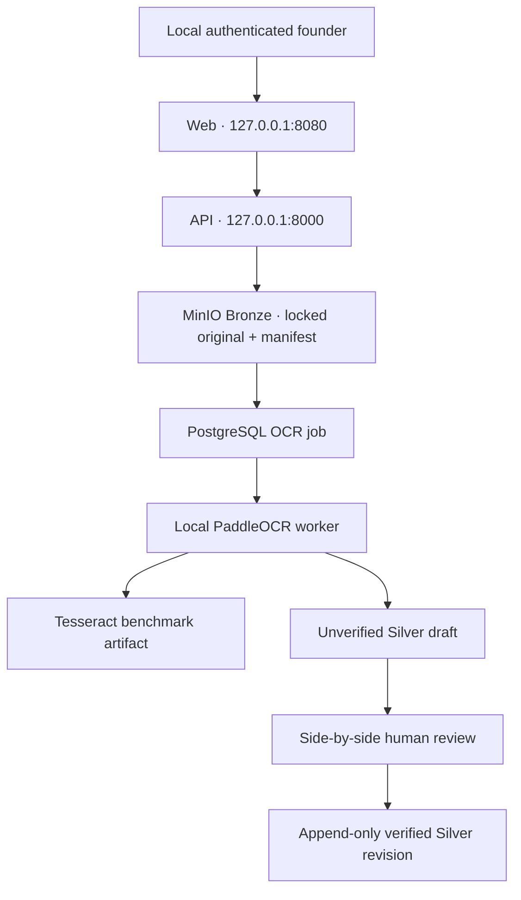

# Phase 1 architecture

## Decision and boundary

Phase 1 is a solo, single-user, local-only R&D pilot on the founder's Apple-Silicon MacBook. Docker Compose binds every published service port to `127.0.0.1`; there is no public route, DNS entry, reverse proxy, HTTPS/TLS endpoint, firewall procedure, cloud OCR, or external vision API. Localhost HTTP is acceptable because traffic does not leave the machine.

This deployment is intentionally temporary. A future phase will migrate the same MinIO/PostgreSQL data model to a shared VPS for multi-department, multi-user collaboration. The Bronze object keys and immutable manifests, Silver schemas, review decisions, and audit contracts will not change; only deployment and authentication will be replaced.

The repository is standalone and has no runtime dependency on `smartcoat-intelligence`.

## Data flow



| Component | Local responsibility | Exposure |
| --- | --- | --- |
| Web | Login, upload, review/correction, activity | `127.0.0.1:8080` |
| API | Validation, state machine, Bronze commit, review | `127.0.0.1:8000` |
| MinIO | Originals, manifests, preprocessing, raw OCR | `127.0.0.1:9000`; console `127.0.0.1:9001` |
| PostgreSQL | Identities, registry, jobs, Silver, reviews, audit | `127.0.0.1:5432` |
| OCR worker | Deterministic preprocessing, PaddleOCR, Tesseract | No port |

Compose uses an internal backend network for database, object-storage, bootstrap, API, and OCR traffic. A separate edge bridge exists only so Docker Desktop can forward explicitly bound `127.0.0.1` host ports; the OCR worker and bootstrap are backend-only and have no external egress. Images and OCR models are downloaded only while building.

## Trust boundaries

1. The upload API computes SHA-256 and detects type from bytes rather than browser metadata.
2. An upload reaches `BRONZE_COMMITTED` only after the original and manifest can be read back and verified.
3. Object keys use a server-generated UUIDv7 and never contain identity or document content.
4. MinIO service users are separated: ingestion can put/get Bronze without delete, OCR can read originals and write artifacts, backup is read-only, and humans receive no MinIO credential. PostgreSQL bootstrap administration is also separated from the non-superuser application role.
5. OCR writes only `DRAFT_UNVERIFIED`. The review service is the only application path that writes a verified revision.
6. Database triggers make Bronze registry rows, review decisions, verified revisions, and audit events append-only.

## State machine

```text
RECEIVED → BRONZE_COMMITTED → OCR_QUEUED → OCR_COMPLETED
→ SILVER_DRAFT_READY → UNDER_HUMAN_REVIEW → VERIFIED
```

Terminal states are `REJECTED`, `OCR_FAILED`, and `REVIEW_REJECTED`. Every transition is compared against the current state and appended to `audit_events`. There is no `OCR_COMPLETED → VERIFIED` transition.

## Authentication evolution

Phase 1 uses one local environment-configured password and a short-lived signed bearer session. The `users`, `uploader_user_id`, `reviewer_user_id`, roles, decisions, and actor-bearing audit rows are already normalized. A future identity provider replaces login/session verification without a schema redesign.

## Apple-Silicon OCR compatibility

The current Linux PaddlePaddle wheel is x86-64, so only the worker runs with Docker's `linux/amd64` compatibility layer. Other containers remain native. PaddleOCR 3.7.0 and PaddlePaddle 3.3.1 are pinned; models are baked into the worker image. This compatibility choice must be revalidated during any dependency upgrade.
