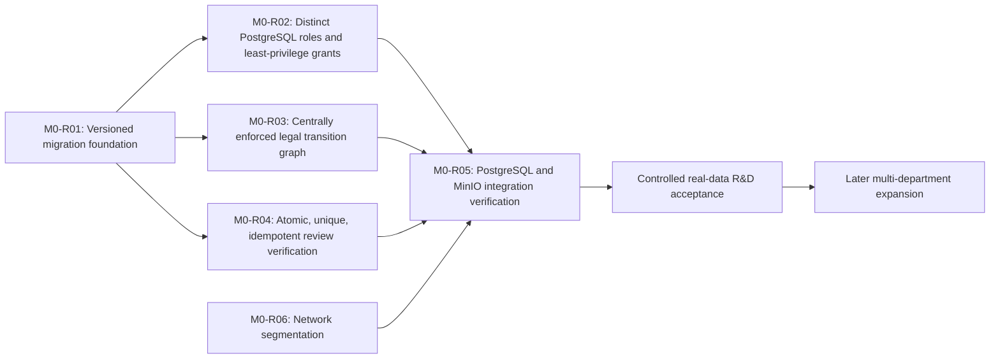

# ADR-0001: Master Roadmap v2 scope expansion and sequencing

## Status

`ACCEPTED`

The sequencing, dependency gates, terminology, and governance record in this ADR were accepted on 2026-08-20. This acceptance does not accept or assert completion of repository implementation, remediation, real-data readiness, or any later-stage capability. The expansion direction remains already authorized and is not reopened by this acceptance.

## Date

2026-08-20

## Decision owners

- User/Program Owner
- Architecture Reviewer

Personal names are intentionally not assigned.

## Context

The repository currently implements a local, R&D-only Bronze-to-Silver pilot. Its architecture protects source evidence in MinIO, produces machine-extracted Silver drafts in PostgreSQL, and requires human review before a verified Silver revision can exist. M0-T01 inventoried the repository and its invariant evidence. M0-T02 completed the executable-baseline ticket with the product baseline classified `BLOCKED`; it did not change repository implementation.

Master Roadmap v2 authorizes a broader unified data and AI platform: multi-department ingestion across structured, document, and photo/scan/video modalities; verified Silver records; a Gold/feature layer; AI, embeddings, and retrieval; catalog and governance; production hardening; and eventual wider rollout.

The repository and the roadmap currently use “Phase 1” for materially different scopes. The repository uses it for the existing local R&D Bronze-to-Silver pilot, while Master Roadmap v2 uses it for universal ingestion and Gold capabilities across at least two departments. This collision makes unqualified phase references unsafe for planning, acceptance, and audit evidence.

The broader direction must be sequenced without weakening the evidentiary controls of the current slice. The existing pilot is therefore the observed starting point, not evidence that later roadmap capabilities exist.

## Standing decision

The accepted long-term direction replaces an R&D-only program scope with the full Master Roadmap v2 direction:

- multi-department ingestion;
- all required source modalities;
- a Gold/feature layer;
- AI, embeddings, and retrieval capabilities;
- catalog, governance, production hardening, and eventual wider rollout.

This ADR does not reopen whether expansion should happen. It records how the already-authorized expansion must be ordered and gated.

The data-lake repository remains architecturally separate from SmartCoat Knowledge Object v2. A future source-feed relationship is allowed, but no runtime integration between the systems is authorized by this ADR.

## Current implemented state

The current implementation is the **Repository Pilot Slice**:

- a local-only, R&D-focused Bronze-to-Silver workflow;
- MinIO Bronze originals and provenance manifests, with versioning, Object Lock, content hashes, manifest verification, and documented 365-day compliance retention;
- PostgreSQL ingestion, OCR job, draft, review, verified-revision, and audit records;
- local PaddleOCR extraction and a Tesseract benchmark;
- machine output limited to `DRAFT_UNVERIFIED` by the application workflow;
- explicit human source comparison and review before a verified Silver revision;
- Docker Compose services with loopback-bound published ports;
- synthetic/local baseline evidence only.

The M0-T02 product baseline remains `BLOCKED`. Its completion established the state of the evidence; it did not approve real company data or broader ingestion.

The following are not implemented by the current slice and must not be described as existing capabilities:

- universal multi-department ingestion;
- a complete structured/document/photo-scan-video normalization platform;
- permanent per-record retention classes or indefinite legal hold;
- a Gold/feature layer;
- embeddings, vector retrieval, knowledge-agent behavior, or model governance;
- a complete catalog/governance platform;
- production hardening or wider organizational rollout;
- runtime integration with SmartCoat Knowledge Object v2.

Current documentation and static configuration express important controls, but the ratified M0 remediation work remains mandatory proof and repair before real company data is admitted.

## Authorized target state

The target is a governed, local-first data and AI platform that can onboard multiple departments through bounded ingestion slices while preserving source evidence and review authority.

The target state includes:

- source-agnostic ingestion lanes for native structured data, document files, and photo/scan/video inputs;
- department ownership and explicit department/data-category access boundaries;
- retention assignment and storage enforcement appropriate to each data category;
- immutable, content-hash-verifiable Bronze originals and provenance manifests;
- versioned, source-linked verified Silver records produced only through the required review boundary;
- Gold outputs derived only from verified Silver inputs;
- AI, embedding, retrieval, and knowledge-agent outputs treated as derived evidence with citations and source lineage;
- catalog, lineage visibility, monitoring, security testing, failure testing, and controlled rollout;
- an optional future source-feed relationship to SmartCoat Knowledge Object v2 without architectural or runtime coupling in this ADR.

The target description is directional. It does not select implementation technologies or imply that any future capability is already present.

## Phase terminology

The following terms are canonical for future planning and evidence:

- **Repository Pilot Slice:** the currently implemented R&D-only Bronze-to-Silver system in this repository.
- **Master Roadmap Program Phase:** one of the broader program phases defined by Master Roadmap v2.

Unqualified use of **“Phase 1” is deprecated**. Every future ticket, design, acceptance report, and status statement must name either the Repository Pilot Slice or the applicable Master Roadmap Program Phase or ADR stage.

Existing filenames and historical document titles containing `PHASE_1` remain unchanged in M0-T03. They are historical identifiers, not permission to continue ambiguous terminology in new decisions.

## Sequencing decision

### Stage 0 — Observed repository baseline

- Treat the current R&D-only Bronze-to-Silver pilot as the observed starting point.
- Treat the available baseline as synthetic/local evidence only.
- Preserve the M0-T02 product-baseline classification `BLOCKED`.
- Do not describe future roadmap capabilities as implemented.

### Stage 1 — Foundation remediation and proof

- Complete M0-T04 and M0-T05 design work.
- Complete M0-R01 before implementing M0-R02, M0-R03, or M0-R04 against existing database volumes.
- Complete M0-R02, M0-R03, and M0-R04 after M0-R01. This dependency does not decide whether those three tickets execute in parallel or sequentially.
- Complete M0-R06 as a hard prerequisite for M0-R05.
- Run M0-R05 only after M0-R02, M0-R03, M0-R04, and M0-R06 are complete. M0-R01 is therefore a transitive prerequisite for M0-R05.
- Admit no real company data before M0-R05 passes.

### Stage 2 — Controlled R&D acceptance

- Run the authorized 5–10-file real R&D acceptance batch only after M0-R05 passes.
- Preserve immutable Bronze originals and provenance manifests.
- Require human-reviewed Silver outcomes; OCR or extraction output alone is not factual evidence.
- Record OCR word accuracy, critical-number/unit accuracy, reviewer correction effort, usability, and failure cases.
- Use this stage to prove the evidentiary workflow before expanding departments or source categories.

### Stage 3 — Multi-department universal ingestion

- Expand through bounded vertical slices to at least two priority departments.
- Support structured, document, and photo/scan/video ingestion lanes.
- Before onboarding each source, require an assigned department owner, explicit access boundary, provenance contract, retention assignment, and verification policy.
- Keep selection of the second department as a separate source-readiness decision; this ADR does not select it.
- Do not defer minimum governance until after multi-department data exists.

### Stage 4 — Gold/feature layer

- Introduce Gold only after verified multi-department Silver inputs exist.
- Permit Gold to consume verified Silver records only, never raw OCR or extraction drafts.
- Defer Gold schemas, aggregates, feature definitions, and KPI definitions to a later design milestone.

### Stage 5 — AI and embeddings

- Add embeddings, retrieval, knowledge-agent behavior, and model governance only after verified Silver/Gold readiness.
- Preserve citations, provenance, and links to verified sources for every derived output.
- Never treat generative output as verified fact.
- Defer selection of vector database, model provider, and embedding model.

### Stage 6 — Complete governance, production hardening, and rollout

- Complete the catalog, lineage visibility, operational monitoring, security testing, failure testing, and rollout controls.
- Require production hardening before wider organizational rollout.
- Defer detailed system design for these capabilities beyond M0-T03.

## Mandatory cross-phase invariants

Every stage and future implementation ticket must preserve these invariants:

1. Bronze originals and provenance manifests remain immutable and content-hash verifiable.
2. OCR or extraction output is not factual evidence until the required human-review boundary confirms it.
3. Verified Silver records are versioned and retain source lineage.
4. Audit history is append-only.
5. Service credentials are distinct and least-privilege.
6. State transitions are centrally enforceable.
7. Review and verification writes are atomic and idempotent.
8. Department and data-category access boundaries are explicit.
9. Gold consumes only verified Silver inputs.
10. AI and embedding outputs remain derived evidence and retain links to their verified sources.
11. The data-lake repository remains architecturally separate from SmartCoat Knowledge Object v2 unless a later decision explicitly defines a source-feed contract.

An invariant is not considered proven merely because it is documented. Its enforcement and integration evidence must satisfy the applicable remediation and phase gate.

## Mandatory remediation dependency graph

M0-R01 is the versioned migration foundation and must complete before M0-R02, M0-R03, or M0-R04 is implemented against existing database volumes. This ADR does not decide whether M0-R02, M0-R03, and M0-R04 execute in parallel or sequentially. M0-R06 is a hard prerequisite for M0-R05. M0-R05 may begin only after M0-R02, M0-R03, M0-R04, and M0-R06 are complete, making M0-R01 a transitive prerequisite for M0-R05. Real-data acceptance depends on successful M0-R05, and later expansion depends on controlled R&D acceptance.

The graph describes dependencies, not permission to parallelize work. The execution relationship among M0-R02, M0-R03, and M0-R04 remains deferred.

## Phase entry and exit gates

### Stage 0 gates

- **Entry:** M0-T01 and M0-T02 are closed, with the M0-T02 product baseline recorded as `BLOCKED`.
- **Exit:** This sequencing record was ratified on 2026-08-20 through M0-T03.2, and Stage 1 design work is authorized. No product-readiness implication follows from this exit.

### Stage 1 gates

- **Entry:** The observed repository baseline and mandatory invariants are recorded without treating documentation claims as implementation proof.
- **Exit:** M0-T04 and M0-T05 design work is complete; M0-R01 completed before M0-R02, M0-R03, and M0-R04; M0-R02, M0-R03, M0-R04, and M0-R06 are complete; and M0-R05 then ran and passed. Until this exit gate passes, real company data is prohibited.

### Stage 2 gates

- **Entry:** M0-R05 has passed.
- **Exit:** The authorized 5–10-file R&D batch is complete; Bronze integrity is evidenced; every Silver outcome is human-verified or explicitly rejected; OCR accuracy, critical-number/unit accuracy, correction effort, usability, and all failures are recorded; and the acceptance decision is signed.

### Stage 3 gates

- **Entry:** Controlled R&D acceptance has proved the evidentiary workflow. Each proposed department/source has minimum governance defined before ingestion: ownership, access, retention, provenance, and verification policy.
- **Exit:** At least two priority departments operate through bounded, accepted ingestion slices across the required lanes, with source-specific governance and review controls evidenced. The second department must have been selected through a separate source-readiness decision.

### Stage 4 gates

- **Entry:** Verified multi-department Silver inputs exist and their lineage contracts are stable enough for downstream derivation.
- **Exit:** Gold outputs demonstrably consume verified Silver only, and later-approved Gold schemas, aggregates, features, and KPI definitions have acceptance evidence.

### Stage 5 gates

- **Entry:** Verified Silver/Gold readiness is established, with source lineage available for derived AI outputs.
- **Exit:** Embedding, retrieval, and knowledge-agent behavior preserve citations and provenance; model-governance and evaluation controls pass; and no generative output is represented as verified fact.

### Stage 6 gates

- **Entry:** Earlier capabilities meet their acceptance gates and the minimum governance controls are already active for every onboarded source.
- **Exit:** Complete catalog and lineage visibility, operational monitoring, security testing, load/failure testing, production hardening, and rollout controls pass before wider organizational rollout.

### Minimum governance versus complete governance

Minimum governance is an onboarding prerequisite, not a late program deliverable. Before any department or source enters Stage 3, it must have:

- a named ownership role;
- an explicit department and data-category access boundary;
- a retention assignment and accountable exception path;
- a provenance contract linking Bronze, Silver, and later derived outputs;
- a verification policy defining when and by whom data may become factual evidence.

The complete catalog/governance platform remains a Stage 6 capability. It adds organization-wide cataloging, lineage visibility, operational controls, and rollout governance; it does not retroactively supply controls that were required before source onboarding.

## Consequences

- The repository pilot becomes the evidence-bearing foundation of a larger program rather than the long-term scope boundary.
- Database-changing remediation begins only after the M0-R01 versioned migration foundation. M0-R02, M0-R03, and M0-R04, together with the mandatory M0-R06 network segmentation, must complete before M0-R05 begins.
- Real company data remains prohibited until this ordered remediation dependency chain culminates in a passing M0-R05.
- Controlled R&D acceptance must prove the repaired evidentiary workflow before multi-department expansion.
- New modalities and departments must enter through bounded vertical slices with minimum governance defined first.
- Gold, AI, and retrieval are downstream derived layers and cannot bypass verified Silver.
- Future planning must distinguish current implementation, accepted target direction, and proven capability.
- The roadmap's provisional week estimates are not commitments and create no dates in this ADR.
- Current documentation will require later, separately authorized alignment, but no existing document is changed by M0-T03.

## Deferred decisions

The following remain undecided and require later design or source-readiness decisions:

- the second priority department and the order of subsequent departments;
- exact source systems and bounded vertical-slice composition;
- whether M0-R02, M0-R03, and M0-R04 execute in parallel or sequentially after M0-R01;
- implementation of `source_modality` and `retention_class`;
- storage enforcement for permanent, long-term, and short retention classes, including any legal-hold mechanism;
- Gold schemas, aggregates, features, KPI definitions, and ownership;
- vector database, model provider, embedding model, and model-serving topology;
- catalog, lineage, and policy-enforcement products;
- production identity provider, shared-infrastructure topology, and remote-access boundary;
- complete production-hardening design and rollout controls;
- any source-feed contract with SmartCoat Knowledge Object v2;
- program dates and any commitment based on the roadmap's provisional week estimates.

Deferral does not weaken the mandatory invariants or onboarding controls.

## Explicit non-goals for M0-T03

M0-T03 does not:

- implement `source_modality` or `retention_class`;
- change schemas, migrations, SQL, Compose, networks, or credentials;
- repair any M0-R finding;
- design Gold tables, aggregates, features, or metrics;
- select AI models, embedding models, model providers, or vector databases;
- select the second department;
- create project dates or promise Master Roadmap v2's provisional week estimates;
- update `README.md` or `docs/architecture/PHASE_1_ARCHITECTURE.md`;
- claim that future capabilities already exist;
- reopen the authorized decision to expand;
- use real company data;
- define runtime integration with SmartCoat Knowledge Object v2;

## Superseded or clarified scope statements

This ADR clarifies existing scope language without editing the source documents:

- `README.md` states that Gold, embeddings, vector databases, multi-department rollout, and related capabilities are out of scope. That remains true for the **Repository Pilot Slice**, but it is superseded as a statement of the program's long-term direction.
- `docs/architecture/PHASE_1_ARCHITECTURE.md` describes an R&D-only local pilot and a later deployment/authentication change. Its current-state description remains valid; its implied long-term boundary is clarified by the broader authorized target and remediation sequence in this ADR.
- Statements that Bronze/Silver contracts “will not change” preserve evidentiary invariants and compatibility intent; they do not prohibit versioned migrations or repairs required by M0-R01 through M0-R06.
- Master Roadmap v2's “Phase 1” refers to a materially broader program scope than the repository's historical “Phase 1.” Unqualified use is deprecated in favor of the canonical terms in this ADR.
- Master Roadmap v2's provisional week ranges are planning context only. This ADR records no schedule commitment.
- The implementation actions in Master Roadmap v2 Prompt B are not authorized by M0-T03 and do not bypass the ratified remediation and proof gates.

## Human-ratification record

### User/Program Owner

- Decision: `RATIFIED`
- Date: `2026-08-20`
- Rationale: Stage 0–6 sequencing, the corrected M0-R01-before-M0-R02/R03/R04 dependency, the M0-R02/R03/R04/R06-before-M0-R05 gate, the prohibition on real company data before M0-R05 passes, and all deferred decisions covering the second department, AI/vector-database technology choices, and schedule are accepted as written.

### Architecture Reviewer

- Decision: `RATIFIED`
- Date: `2026-08-20`
- Rationale: Independently verified that BRONZE_IMMUTABILITY_POLICY.md, SILVER_REVIEW_POLICY.md, and PHASE_1_ACCEPTANCE_REPORT_TEMPLATE.md exist at the referenced repository paths. The dependency graph—M0-R01 before M0-R02/R03/R04; M0-R02/R03/R04/R06 before M0-R05; and M0-R05 before controlled acceptance and expansion—is architecturally sound and consistent with the closed M0-T01 and M0-T02 findings. No inconsistency was found with prior closed tickets.

## References

- *Unified Data & AI Platform — Master Roadmap & Foundational Design v2.0*, August 2026.
- [`README.md`](../../../README.md)
- [`docs/architecture/PHASE_1_ARCHITECTURE.md`](../PHASE_1_ARCHITECTURE.md)
- [`docs/governance/BRONZE_IMMUTABILITY_POLICY.md`](../../governance/BRONZE_IMMUTABILITY_POLICY.md)
- [`docs/governance/SILVER_REVIEW_POLICY.md`](../../governance/SILVER_REVIEW_POLICY.md)
- [`docs/governance/PHASE_1_ACCEPTANCE_REPORT_TEMPLATE.md`](../../governance/PHASE_1_ACCEPTANCE_REPORT_TEMPLATE.md)
- [`docs/runbooks/VPS_DEPLOYMENT.md`](../../runbooks/VPS_DEPLOYMENT.md)
- [`docs/runbooks/OCR_EVALUATION.md`](../../runbooks/OCR_EVALUATION.md)
- [`docs/runbooks/BACKUP_RESTORE.md`](../../runbooks/BACKUP_RESTORE.md)
- M0-T01 read-only repository and invariant inventory, formally closed.
- M0-T02 executable baseline verification, ticket closed with product baseline `BLOCKED`.
